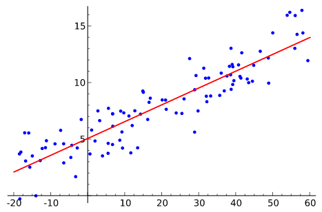

# 自然言語処理100本ノックまとめ

自然言語処理100本ノックで得られた知見のメモ。

## 準備（1章）

### n-gram

文字列を"n"個の文字（や単語）に分割すること。

文字で分割　N=2 bigram

```shell
'今日', '日は', 'はい', 'いい', 'い天', '天気', '気で', 'です', 'すね', 'ね。'
```

文字で分割　N=3 trigram

```shell
'今日は', '日はい', 'はいい', 'いい天', 'い天気', '天気で', '気です', 'ですね', 'すね。'
```

自然言語処理の前処理に使用したり、機械翻訳の評価指数であるBLEUスコアにも使われる。日本語では、文章を単語毎に分ける形態素解析と比べて未知語にも対応できる利点がある。辞書を作る手間が省けて、共起表現を含んだ分割ができるので、地味に今でもよく使われているみたいです。（ただしノイズも多い）

## UNIXコマンド（2章）

簡単なファイル操作はpython使うより手軽でとても便利。

```zsh
wc -l {file} # 行数を出す。word count(wc) lは多分line。
# 1100　など
sed 's/\t/ /g' {file}  # ファイル書き換え。 Stream EDitor(sed).
# fileのタブを空白に置き換わる
```

## 正規表現（3章 regex）

### json

データセットを読み込むのにpythonのjsonライブラリーを使用した。

```python
import json
dic = json.loads('{"bar":["baz", null, 1.0, 2]}')
print(type(dic))
print(dic)
```

```python
# out
#<class 'dict'>
#{'bar': ['baz', None, 1.0, 2]}
```

> loads, dumpsのsは3単現ではなくstringを意味します。

[らしい。](https://qiita.com/hi-asano/items/8e303425052781d95f09)

### jsonlines

要素毎に改行が入ったjsonlフォーマットで保存すると見やすい。

```python
import pandas as pd

df.to_json("filename.jsonl",orient='records', lines=True))
# {"col1":1,"col2":"a"}
# {"col1":2,"col2":"x"}
# {"col1":3,"col2":"\u3042"}
```

### regex

文字列のパターンを記号で指定する手法。
以下の様にすると[可読性が上がるな](https://qiita.com/hi-asano/items/8e303425052781d95f09)と思った。

```python
import re
pattern = re.compile(r"""
        \[\[        # [[
        ([^|]+\|)*  # 記事名|　無かったり繰り返されたり
        ([^]]+)     # 表示文字 patternにマッチした部分をこいつに置換する
        \]\]        # ]]
    """, re.VERBOSE)
```

### キャプチャ

( ) でマッチした文字列を、\\1, \\2, ... \\nで順番に抽出することができる。

```python
text = "2016-05-08"
pattern = re.compile(r'(\d+)-(\d+)-(\d+)')
pattern.sub(r'\1年\2月\3日', text)
# => 2016年05月08日
```

## 形態素解析（4章 MeCab）

英語と違い、日本語の自然言語処理では単語間の区切りが明確でないです。英語なら単純にスペースで区切って"Hello World."→["hello", "world"]できますが。
MeCabは日本語の文章を単語に分けることができます。

```python
import MeCab
wakati = MeCab.Tagger("-Owakati")
words = wakati.parse("ここではきものを脱いでください")
print(words)
#ここ で は きもの を 脱い で ください
```

もっと早く動作するginzaというのもあるようです。
[ginza,spacyの解説](https://www.ogis-ri.co.jp/otc/hiroba/technical/similar-document-search/part4.html)

## 係り受け解析（5章 CaboCha）

単語間の修飾関係など、係りかたを解析できます。重要語抽出を[グラフ的に解く](https://www.ogis-ri.co.jp/otc/hiroba/technical/similar-document-search/part5.html)（多くのグラフが集まっているほど重要）場合などに使われます。ここでもginza使えます。

```shell
  番号  文節          係り先
------  ----------  --------
     0  吾輩は             5
     1  ここで             2
     2  始めて             3
     3  人間という         4
     4  ものを             5
     5  見た。            -1
```


## 機械学習（6章 pytorch）

英語のニュースのタイトルからそのカテゴリー（business, scienceなど4種類）を分類する問題を、ロジスティック回帰を用いて挑みました。特徴量は単語カウント（Bag of Words）を用いました。

### Bag of Words

単語の種類を次元の数として、ある文章に出現する単語の回数をカウントしてベクトルとします。
単語の順序は反映されません。単純ながらも、文書のカテゴリー分類などでそこそこ精度を出せます。

### Dataset

問題と答え(label)のペアを読み込むクラス。前処理を含む。
train,validation,testについて作成する。

### DataLoader

Datasetからどのようにデータを取り出すかを決めるクラス。バッチ(複数のデータを一気に学習させるため、まとめたもの)を作る。

* DataLoaderにおいて、単語は**ベクトルでなくID**で表現する。
  これは、ベクトル表現で単語データを持つとメモリを大量消費するから。モデルのemmbeder層でID→ベクトルに変換させたりします。

### nn.Module()とforward

ネットワーク層を担うこのモジュールは、以下のようなフォーマットを基本とする。

```python
import torch.nn as nn
import torch.nn.functional as F

class Model(nn.Module):  # nn.Module()でないことに注意
    def __init__(self,arg*):     # コントラクタと呼ぶ。 Model()を宣言した時、最初に一度だけ実行される関数。arg*がModel()の「引数」
        super().__init__()   # 継承元クラスのコントラクタが破棄されないよう継承する。
        # ここにネットワーク層を記述する。net1,2,3,..など。以下はconvolution層が2層の場合。
        self.conv1 = nn.Conv2d(1, 20, 5)  # ↑でself.conv1,2の他に、
        self.conv2 = nn.Conv2d(20, 20, 5) # nn.Moduleのコントラクタで宣言している変数(self.trainingなど)も使える。

    def forward(self, x):  # nn.Moduleの__call__関数により、Model()(x)で実行される。
        x = F.relu(self.conv1(x))
        return F.relu(self.conv2(x))  # forwardのreturnがModel()()のreturn
```

### 損失関数 loss

ネットワークモデルがだした予測と、実際の答えの解離を出す。

### 最適化手法 optimizer

重みの更新を行う。
modelの重みをmodel.parameters()で渡す。
重みはModel.conv1.weightとかに保存されてる。

### ロジスティック回帰

パーセプトロンは、y=ax+bを損失関数（ヒンジ損失）と最適化アルゴリズムにより重みaやバイアスbを最適化（つまり学習）させる。活性化関数は2値（[0,1]や[-1,1]）を出力するステップ関数が使われる。  
**ヒンジ損失：（真の値）-（予測値）^2**

これに対し、ロジスティック回帰は活性化がシグモイド関数で、
損失関数が交差エントロピー誤差関数で、
過学習を防ぐための罰則化項が加わっている。

パーセプトロンでも、ロジスティック回帰でも、線形分離可能な対象を分離するアルゴリズムである。（線で区切って、上か下かで分類）



図の引用wiki

### 性能評価

### 混同行列

機械学習モデルの予測（x）と実際の答え（y）の実測値（回数n）をプロットしたもの。
左上から右下へ斜めに数字が集まっているほど精度が良い。


## 再現率(陽性の中での正解率)、適合率（陽性と予測した時の正解率）


引用　<https://mathwords.net/kensa>

マイクロ平均：ラベルのクラスを無視した（下記b,t,e,mを区別しない）平均

マクロ平均：ラベルのクラス毎の確率の和/クラス数によって出される平均

<https://datascience.stackexchange.com/questions/15989/micro-average-vs-macro-average-performance-in-a-multiclass-classification-settin>

文章をb,t,e,mに分類するタスクがあったとして、以下の様になる。


## 単語ベクトル（7章）

単語→ベクトルを出力する学習済みモデルを用いました。

```python
from gensim.models import KeyedVectors
model = KeyedVectors.load_word2vec_format('GoogleNews-vectors-negative300.bin.gz', binary=True)
model["United_States"]  # model[単語]
```

word2vecではCBOWやskip-gramというアルゴリズムがあります。文章中のある文字を隠して、機械学習モデルに隠した文字を当てさせるという問題を解かせ、モデルに単語を突っ込んだときの重みを単語ベクトルとして利用しています。
RGB表記だと色の近さが分かるように、(ターコイズ=(0,183,206)とシアン=(0,174,239))
単語の意味の近さが分かるようになります。(コサイン類似度など)

### 意味的アナロジー、文法的アナロジー

意味的アナロジー（semantic analogy）：単語の意味関係からの類推。man + queen = king

文法的アナロジー（syntactic analogy）：単語の文法関係　　〃　　。「eat →  ate」 なら「cook → cooked」

## ニューラルネット（8章）

ニューラルネット：活性化関数を変更したパーセプトロンを多層にしたもの。
（ステップ関数→シグモイド関数、ReLU関数など）

今回は特徴量として、文章データを単語ベクトルの平均として扱った。
文章を直接ベクトル化する方法もある。(bertモデルや[SCDV](https://nykergoto.hatenablog.jp/entry/2019/02/24/%E6%96%87%E7%AB%A0%E3%81%AE%E5%9F%8B%E3%82%81%E8%BE%BC%E3%81%BF%E3%83%A2%E3%83%87%E3%83%AB%3A_Sparse_Composite_Document_Vectors_%E3%81%AE%E5%AE%9F%E8%A3%85)(Sparse Composite Document Vector)　など)

## RNN(LSTM)（9章）

文章中の単語間の順序を考慮することができます。しかし、RNNで使う隠れ状態ベクトルhは直前の単語ベクトルの影響を大きく受けるので、文中の単語ベクトルを任意の重みで参照できる、Self-Attentionの方が好まれます。
<https://qiita.com/t_Signull/items/21b82be280b46f467d1b>

ただしNLP100Knockから引用

## 機械翻訳（10章 fairseq）

(fairseq-trainにはpytorch1.4>とGPUが必要)

Facebook AI Research Sequence-to-Sequence Toolkitらしいです。機械翻訳の
LSTM, Transformer, Bert_baseなどのモデルをコマンドラインで学習させることができます。

```shell
fairseq-preprocess # 辞書作ったりバイナリー化。
faiseq-train # GPUを使用して学習。tensorboard用ログも保存できる。CPUの引数もある？
```

```python
from fairseq.models.transformer import TransformerModel
model = TransformerModel.from_pretrained('path/to/checkpoint_dir', checkpoint_file = 'model.pt')
model.translate("Hello world.")
# 世界の皆さんこんにちは。(日本語→英語の機械翻訳モデルの場合)
```

### Transformer

私たちは日本語→英語に翻訳を行うとき、（猫→cat）などのように、特定の単語から翻訳を行います。
RNNの隠れ状態ベクトルは直前の単語の影響を強く受けたもので、直前でなく特定の単語の影響を強く受けたベクトルの方が好ましいです。
また、RNNはGPUをフルに使うことができません。
このような問題を解消するAttentionという技術を使用したモデルがTransformerです。
入力された文章の単語ベクトル(緑)、Attention(黄色)、翻訳された単語(オレンジ)

この辺がAttentionの説明わかりやすかった。
<https://qiita.com/Kosuke-Szk/items/d49e2127bf95a1a8e19f>

### BLEUスコア

> 人間が翻訳した文章に似ていれば似ているほど、機械が生成した文は正しそうだという前提に基づいています。
> 翻訳した文章のn-gramと正解文章のn-gramの差が少ないかをスコアにします。基本的には4-gramがよく使われます。
> 100に近いほど性能がよく、Transformerで20くらい出るみたいです。
> <https://to-in.com/blog/102282>
>
> ```zsh
> fairseq-score --sys translated.spacy --ref test.spacy.en
> #Namespace(ignore_case=False, order=4, ref='test.spacy.en', sacrebleu=False, sentence_bleu=False, sys='98_2.out.spacy')
> #BLEU4 = 11.07, 36.2/14.0/7.2/4.1 (BP=1.000, ratio=1.129, syslen=31201, reflen=27625)
> ```
>
> BLEUスコアは同義語でも間違いにしてしまいますが、[BERTスコア](https://ai-scholar.tech/articles/natural-language-processing/bleu-score-bertscore-bert-n-gram-natural-language-processing)というものは文章ベクトルを比較するので、対応できると言われています。

### ビームサーチ

幅優先探索を、指定したビーム幅分だけ更に探索していく。
文章の機械翻訳で、正解率が高い単語から始まる文だけ（ビーム幅分）を検討することにより、
計算量を減らすことができる。

```zsh
N=5 # ビーム幅
fairseq-interactive --path checkpoint.pt --beam $N data
```

### サブワード

低頻度で現れる単語を、数文字単位に分割する方法。
従来の単語に分割する前処理に比べ、文字単位に分割すれば
語彙数を抑えて計算量を少なくしつつ
未知語がなくなるという利点がある。
<https://qiita.com/NLPingu/items/78f11ec4c3b777f56f11>

word2vecにサブワードなどを取り入れたものがfastextらしい。

```zsh
subword-nmt learn-bpe -s 3000 < wakati_wagahai.txt > codes.txt
subword-nmt apply-bpe -c codes.txt < wakati_wagahai.txt > subword_wagahai.txt
# The rain@@ y season began in the southern area of Kyushu around May@@ .@@ 31 (F@@ ri@@ ) as norm@@ al.
# rain@@ yは元々rainy一語であったことを示している。
```

単語→数文字がサブワードである一方、
文章→数文字は[SentencePiece](https://qiita.com/taku910/items/7e52f1e58d0ea6e7859c)という。最近の機械学習モデルのstate of the art(精度新記録)はこれが使われているとか。

### 機械翻訳の結果

fairseq を用いて日本語の古文→英語の翻訳を学習させた Transformer モデル(.pt)を flask を使用して使えるようにしました。

精度は微妙です...


