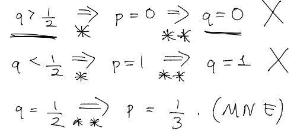

#  Game Theory まとめ

昔の記事

1. [1](https://qiita.com/NMZ0429/items/eeecc51fb54d4e60d42d)
2. [2](https://qiita.com/NMZ0429/items/691563ef39ab6d302cdf)

## Substraction Game

  1. Terminal = P
  2. State connected to P state is N
  3. State connected to only N state is P
  4. Return to 2

### Sum of Combinatorial Games

  Given two distinct games, SG function of the combination of the two games is **nim** sum of SG functions of each game.

  * **$x \bigoplus y = 0$ IFF $x = y$**
  * Nim-sum is commutative and associative

---

## Zero-Sum Game

### Solution of 2 by 2

1. If exists, the saddle point is the solution
2. Otherwise, MINMAX strategy of 1st player gives the optimal player
3. **Value of Game** is the expected payoff of 1st player

### Solution of 2 by M

1. If saddle point exists, done
2. Otherwise, try to reduce into 2 by 2 by domination
3. If not possible, use test domination. Plot $M$ lines in terms of p such that each line is the expected payoff for each column. The point which maximizes the minimum of those $M$ lines is MINMAX.
4. If M by 2, take transpose and multiply negative one. Then second player becomes first player. Or plot for each row and minimize maximum.

### Solution of N by N

1. If no reduction is possible, use indifference. That assumes that all column expectation is equivalent to the value of the game. This translates the problem into solving linear equation. Use calculator.

---

## NTU

### 1. PNE

  1. Max of the column for first player
  2. Max of the row for second player

### 2. MNE

  1. Reduce to 2 by 2.
  2. Consider one's expected gain **in terms of opponent's move**
  3. For each case, consider the best reaction of one's move.

  

  

  

  

  

  

  

### 3. TU feasible set and NTU feasible set

  

  * A feasible payoff vector, $(v_1,v_2)$, is said to be **Pareto optimal** if the only feasible payoff vector $(v_1′ ,v_2′ )$ such that $v_1′ ≥ v_1$ and $v_2′ ≥ v_2$ is the vector $(v_1′ ,v_2′ ) = (v_1,v_2)$. It is the right top edge of the set.

### 4. Solution of NTU Game

  1. Find safety values for each player
  2. One of NME, NPE or MINMAX strategy is the solution.

---

## TU

  * The game is **inessential** if $sum(v(i)) = v(n), otherwise **essential** (if inessential, only Imputation is $v(i)$)

### 5. Solution of TU Game

  1. $σ$ = max( sum of each entry of bi-matrix)
  2. $(D_1, D_2)$ = $(Val(A), Val(B))$
  3. Optimal payoff line = $(D_1, σ - D_2)$ and $(σ - D_1, D_2)$
  4. $δ$ = $Val(A - B)$
  5. $φ$ = $σ+δ / 2 , σ-δ / 2$

### 6. Imputation

  Possible distributions of $v(N)$

  1. Convert to coalitional form
  2. Find the payoff vector with $sum(x) = v(N)$ and $x_i \geq v(i)$

### 7. Core

  1. Subset of Imputation with $sum(x_S) = v(S)$.
  2. The core is also called **Stable imputation**. Other imputations not core is said to be **Unstable**.

### 8. Shapley
  * Shapley is unique
  * Shapley vector must satisfy

  1. **Efficiency**: $sum(φ_i) = v(N)$
  2. **Symmetry**: if characteristic function is symmetric for some two players, Shapley is also equivalent.
  3. **Dummy Axiom**: If player $x$ does not increase values of any coalition with $x$, $φ_x = 0$
  4. **Additivity**: sum of Shapley values of two distinct games equals to Shapley of sum of two game.

  * Calculated as
  

  Summation occurs for all coalitions including the player $i$
