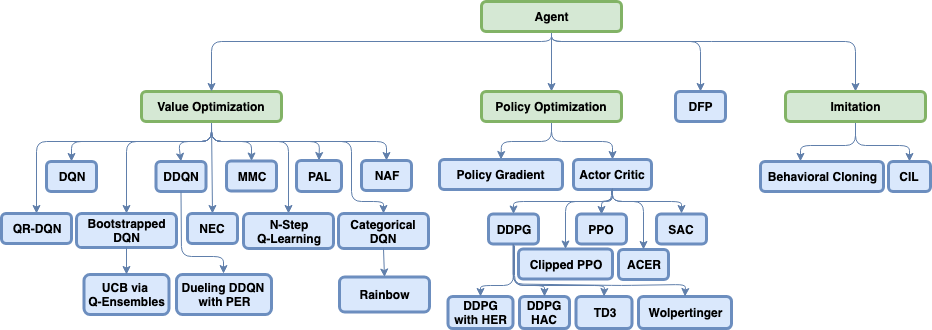

# 強化学習フレームワークまとめ

強化学習フレームワークは色々ある割に使っている人が少ないからか、ドキュメントが不足しがちです。  

今回は各フレームワークの短所, 長所についてざっくりまとめてみました。 

フレームワークを使うときの一助になれば幸いです。

## そもそも強化学習フレームワークって何？

かっちりとした定義があるわけではありませんが、ここでは

* 強化学習のagentのアルゴリズム（例 TRPO, A3C, ...）がすぐ使える形で実装されている
* 強化学習を走らせたときに、学習の様子がお手軽に可視化できるようになっている（例　Tensorboard対応）
* 自分でカスタムの環境や、エージェントを追加して学習させることができる
* 学習のためのコードが抽象化された形で提供されており、学習を細かく実装しなくてもよい

のどれかを満たすものとします。

短くまとめると  
**モデルと学習の実装、学習、可視化のうちどれかを楽にしてくれるライブラリ**だと言えます。

## 使用上の注意点

便利な反面...  

**バグにハマると戻ってこれない**

* 使用者が少ないので、ドキュメントは少なくなりがち
* フレームワーク自体の実装が複雑になりがち

という短所もあります。  
例えば[OpenAI Spinning Up Document](https://spinningup.openai.com/en/latest/spinningup/spinningup.html#the-right-background)にも

> RL libraries frequently make choices for abstraction that are good for code reuse between algorithms, but which are unnecessary if you’re only writing a single algorithm or supporting a single use case.

と記されています。

**高機能、高抽象度になればなるほど、フレームワーク内部の実装は複雑になってゆく**ので

* そもそもフレームワークは必要なのか？
* どの程度までフレームワークにやってもらうのか？

ということを考慮してフレームワークを選ぶことをお勧めします。

## 使えそうなフレームワーク

## [RL Coach](https://ray.readthedocs.io/en/latest/rllib.html#rllib-in-60-seconds)

TensorflowとMXnetをサポートするインテル謹製のフレームワーク。 

### 長所

1. 実装済みのアルゴリズムが非常に多い 
   

2. open AI gym含む対応済みの学習環境が多い(<https://github.com/NervanaSystems/coach#supported-environments>)  

3. [preset](https://github.com/NervanaSystems/coach/tree/master/rl_coach/presets)という機能により、モデルに渡すハイパーパラメータのみを書いたファイルを作れる  
   複数のpresetを書いておけば、複数のハイパーパラメータをコードの修正をせずに試すことができる 

4. 学習中のエージェントの行動をリアルタイムで表示することができる（<https://nervanasystems.github.io/coach/usage.html#rendering-the-environment）>

5. [dashboard](https://nervanasystems.github.io/coach/dashboard.html#tracking-statistics)機能によって詳細な学習結果の可視化ができる
   * マルチエージェント学習のときは、全エージェントの学習結果を一つのグラフにまとめて表示できる
   * 同じアルゴリズムで実験を複数行ったとき、それらの学習曲線の平均を取ったグラフを自動で表示できる 
     　\-> これは学習が安定しにくいときに、モデルの性能を見るのに役立つ

### 短所

1. 全体的に実装が複雑なので、自分で新たにエージェントを追加するのが難しい  
2. エージェントを分散させるのが後述のRLlibより難しく、さらにAWSのS3を使わなければならない
3. 前述の[dashboard](https://github.com/NervanaSystems/coach/blob/master/img/dashboard.gif)が使いにくい

## [RLlib](https://ray.readthedocs.io/en/latest/rllib.html)

全フレームワークをサポートしているエージェントの分散化に強いフレームワーク  
Tensorflow, Pytorchだと、エージェントの実装が少し楽になる。

### 長所

1. 個々のワーカを実装するだけでマルチエージェント学習が組める  
   * マルチエージェント学習の「ワーカが学習 -> パラメータ更新」という処理を[Trainer](https://ray.readthedocs.io/en/latest/rllib-concepts.html#trainers)がやってくれる
   * マルチエージェント未対応の深層学習フレームワークでもマルチエージェント学習が可能  

2. 分散化を用い、自動でハイパーパラメータのチューニングが可能（[tune](https://ray.readthedocs.io/en/latest/tune.html)ライブラリ）  
   * Population Based Trainingなどのハイパーパラメータ調整のSOTAなアルゴリズムも使える

3. 学習用の環境はopen AI gym形式で書けば追加できる  

4. 可視化はtensorboardを使える

### 短所

1. 内部の実装が複雑で、自分で新たにエージェントを追加するのが難しい  
2. 使われているRayというライブラリ独特の分散処理表現を習得しなければならない  

## [dopamine](https://github.com/google/dopamine)

Google発の強化学習フレームワーク（ただしgoogle公式のプロジェクトではない）

### 長所

1. 学習中の詳細なログ（学習曲線、リプレイ用のバッファ、モデルのパラメータ）をginを使ってmemory efficientに記録してくれる  
2. モデルの行動のリプレイ動画がかんたんに作れる  

### 短所

1. 実装済みのエージェントのアルゴリズムが４つしかない（DQN, rainbow, C51, IQN）  
2. ドキュメント不足  
3. 対応している環境がAtariしかなく、環境の追加方法についてのドキュメントがないので、自分で環境を追加するのは骨が折れる  
4. contributerが４人しかおらず、コードの大半をそのうちの一人が書いているので先行きが不安

（追記: 昨年12月からコミットがないです。）
 

## [Stable Baseline](https://github.com/hill-a/stable-baselines)

tensorflowに対応している、openAI baselinesのフォーク。  
フレームワークというよりもモデルの実装集

### 長所

1. scikit learnにAPIが似せてあるため、使いやすい  
2. 基本的なモデルは実装済み  
    
3. エージェントのアルゴリズムの実装がコメントを多用してわかりやすく書かれており、改造しやすい  
4. マルチプロセス化にも対応

#### 短所

1. openAI gymがサポートしている環境しかサポートしていないので、他の環境は自分でラッパーを書かなければならない 
2. 実験のためにコードを書かなければならない

## 使えなさそうなフレームワーク

### [Tensorforce](https://github.com/tensorforce/tensorforce)

名前の通りTensorflowに対応したフレームワーク。

### 長所

モジュール化がきちんとなされており、勉強したり書いたりしやすい

### 短所

1. あまりエージェントのアルゴリズムは実装されていないので、自分で書かなければならない 
2. ドキュメントの量や詳しさが少し物足りない

## [Keras-RL](https://github.com/keras-rl/keras-rl)

名前の通りKerasに対応したフレームワーク。

### 長所

そもそもドキュメントがなさすぎて何が長所なのかすらよくわからない

### 短所

1. ドキュメントが信じられないくらい少ない。本当に少ない。（<https://keras-rl.readthedocs.io/en/latest/core）>  
2. あまりエージェントのアルゴリズムは実装されておらず、自分で書かなければならない 

## その他

* [A Comparison of Reinforcement Learning Frameworks: Dopamine, RLLib, Keras-RL, Coach, TRFL, Tensorforce, Coach and more ](https://winderresearch.com/a-comparison-of-reinforcement-learning-frameworks-dopamine-rllib-keras-rl-coach-trfl-tensorforce-coach-and-more/)  
* [OSS強化学習フレームワークの比較](https://www.slideshare.net/greetech/oss-128905651)
* [A Primer on Deep Reinforcement Learning Frameworks Part 1](https://medium.com/@vermashresth/a-primer-on-deep-reinforcement-learning-frameworks-part-1-6c9ab6a0f555)
