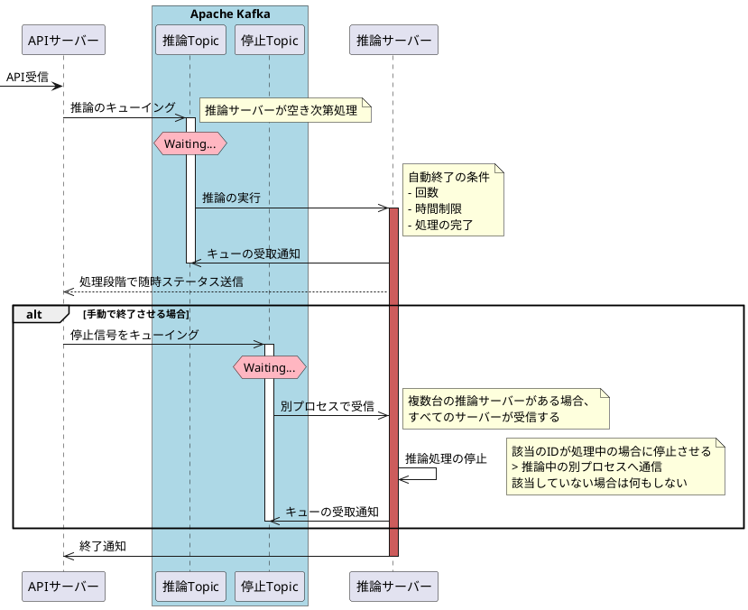

# PlantUMLのススメ

PlantUMLとはUMLダイアグラムをテキストで作成できる言語  
図を書くことがあるならPlantUMLを使おう！っと言うぐらいに図を書くならこれっというツール

本Wikiではサポートされており、MarkDown内に普通に書くことでレンダリングされる  
たまに未対応の書き方があり、プレビューがエラーするので注意  
※ `<` は大体うまく出力されない

VS Codeを開発環境にすると、とても捗る([下記参照](#vs-codeで書く))

## PlantUMLでできること

ダイアグラム図をテキストで書くことができる

- クラス図
- パッケージ図
- オブジェクト図
- アクティビティ図
- ユースケース図
- ステートチャート図
- シーケンス図
- コラボレーション図
- ER図
- etc...

シーケンス図やER図などに用いることが多い

- 参考
    - [UMLとは？｜ダイアグラムの種類や用途について解説 | PINTO!](https://service.plan-b.co.jp/blog/tech/12404/)
        - 各図の画像があるのでイメージが付くか見やすいと思う

## メリット・デメリット

- テキストで管理するためGitなどでバージョン管理ができる
- 図の配置などを細かく悩む必要がない
    - 図と関係の線を定義すれば、よしなに引かれるので、ズレて微妙になる悩みから開放される
    - 逆に調整したくてもできないという点はあるが、できないものはしょうがないと割り切れる
- 書き方を覚える必要がある
    - GUIツールなどはない
    - 基本公式の書き方をコピペして組み合わせれば十分

## サンプル

よく使う図のサンプル

### ER図

- [公式サンプル](https://plantuml.com/ja/ie-diagram)

基本的に押さえておけばいいレイアウトはコレ


論理名、物理名の書き方は個人差がでてしまうが、DBが複雑になっても線の引き方を迷ったりせず、テーブルを位置なども気にしなくて良いのが強い


### シーケンス図

- [公式サンプル](https://plantuml.com/ja/sequence-diagram)

#### 例

- この図から必要なものを抜粋して抜くと多分わかりやすい
- 大体主要なシーケンス図のパーツは使ってる
- *mkdocs*で表示できないバグがある為コードも載せておきます。



```

@startuml

participant "APIサーバー" as A

box "Apache Kafka" #LightBlue
participant "推論Topic" as B
participant "停止Topic" as C
end Box

participant "推論サーバー" as D

[-> A: API受信

A ->> B: 推論のキューイング
activate B

hnote over B #LightPink: Waiting...
note right: 推論サーバーが空き次第処理

B ->> D: 推論の実行
activate D #IndianRed
note right
自動終了の条件
- 回数
- 時間制限
- 処理の完了
end note

D ->> B: キューの受取通知
deactivate B

D -->> A: 処理段階で随時ステータス送信

alt 手動で終了させる場合

    A ->> C: 停止信号をキューイング
    activate C

    hnote over C #LightPink: Waiting...


    C ->> D: 別プロセスで受信
    note right
    複数台の推論サーバーがある場合、
    すべてのサーバーが受信する
    end note

    D ->> D: 推論処理の停止
    note right
    該当のIDが処理中の場合に停止させる
    > 推論中の別プロセスへ通信
    該当していない場合は何もしない
    end note

    D ->> C: キューの受取通知
    deactivate C

end

D ->> A: 終了通知
deactivate D

@enduml
```

## Gitのリポジトリの置き方

リポジトリのルートに `plantuml.pu` っという名前で置くのがベタ  
他にも拡張子がいくつかあるのでお好みに

## VS Codeで書く

基本プラグインのREADME通り

### インストール

1. 必要なツールをインストール

```bash
$ brew cask install java
$ brew install graphviz
```

2. VS Codeのプラグインをインストール
    - [リンク](https://marketplace.visualstudio.com/items?itemName=jebbs.plantuml)

### 使い方

1. PlantUMLファイルを開き、 `cmd+shift+p` でコマンドパレットを開き `カーソル位置のダイアグラムをプレビュー` を選択
2. 右側に分割ウインドウでリアルタイムにプレビューが表示される

### プレビュー表示時に、PATHが通っていないとエラーがでる場合

設定からPlantuml：Javaの設定項目を探し、インストールしたJavaのフルパスを登録します。

参照：[【VScode】PlantUMLのビューがjava pathエラーで表示されない](https://qiita.com/Utsumi_Re/items/4824de73b7202ee8e623)

