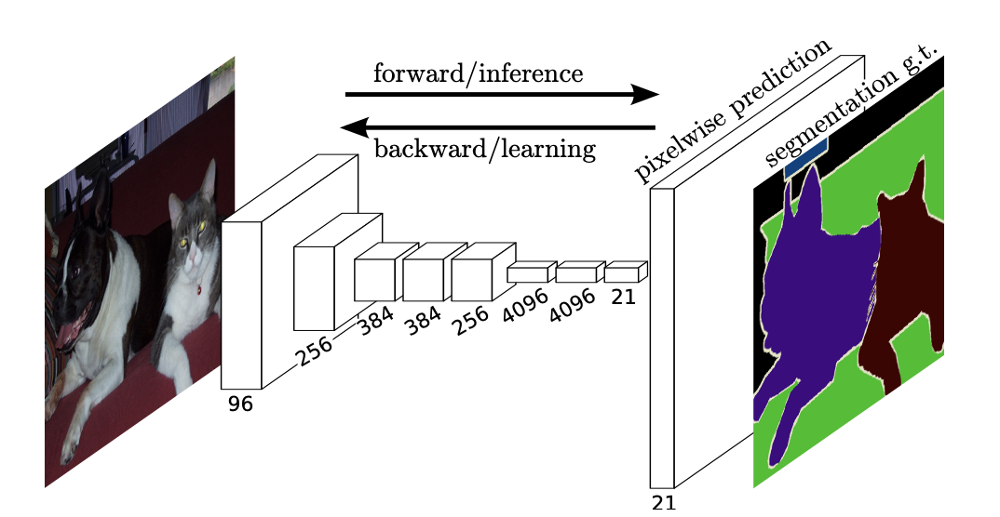
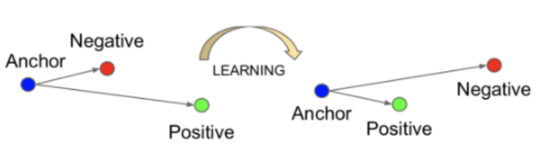
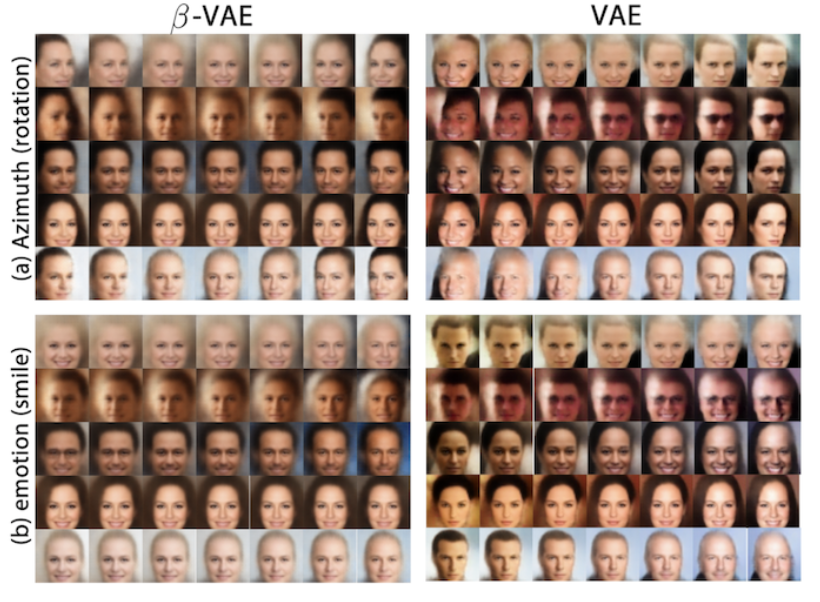
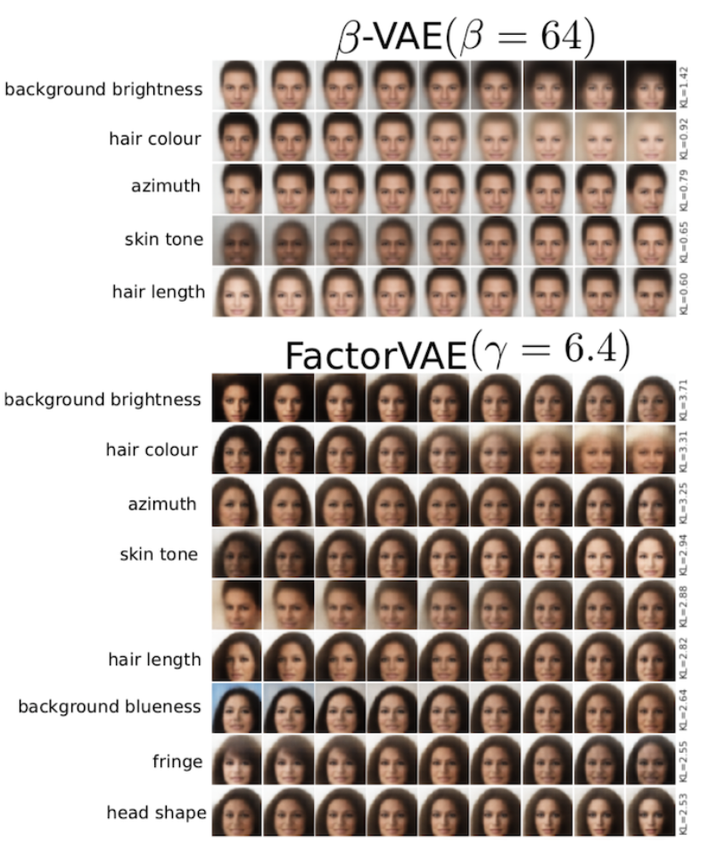

# 表現学習についてまとめのまとめのまとめ

表現学習のまとめです。表現学習は最近流行りの自己教師あり学習を含む非常に応用性の高い学習手法であり、様々なタスクに対応できる可能性を秘めています。とりあえず勉強するかちありかも？？

## 1. 表現学習

画像等の高次なデータをより低次な表現に変換する(低次元空間に埋め込む)をする。このときにできるだけ情報を失わないかつ、それぞれの圧縮された表現がなにか高度な意味を持つように変換する。その目的はとしては以下が挙げられる。

1. 表現を低次元な表現にすることによって処理を軽くする
2. より本質的な情報を抽象化して取り出すことによってさらに他のタスクを行いやすくする
3. 上記特性によるTransfer Learningへの適応性を高める

### 1-1. 表現学習の分類

* 精度を高めるタスクによる学習
* 距離学習
* 深層生成

### 1-2. 学習を用いない特徴抽出

表現学習から得られる情報は研究は進んできているが、それぞれが何を意味しているか明確にするのは難しい。求めたい画像の中の特徴量によっては学習によらないもので済む可能性がある。これらの最近の動向をまとめたsurvey論文が以下である。

* [Recent Advances in Features Extraction and Description Algorithms: A Comprehensive Survey. Ehab Salahat, Member, IEEE, and Murad Qasaimeh, Member, IEEE](https://arxiv.org/pdf/1703.06376.pdf)

## 2. 精度を高めるタスク

### 2-1. 分類

* Supervised
  * "Full"-supervised
  * Semi-supervised
  * Weakly-supervised

* UnSupervised
  * Self-Supervised

### 2-2. Supervised

ここでは全てラベルありで学習を行ういわゆるSupervised learning とその他のSemi-supervised learningやWeakly-supervised learningを区別することなく、何かしらのラベルありの学習を行うことでNNの任意の層から特徴量を取り出すことのできる手法としてよく使われるものを挙げる。

#### 分類

1. Semantic Segmentation
2. Object Detection
3. Image Cpationing
4. Action Recognition

#### 2-2-0. まとめ

supervisedな方法で特徴を取得する方法は本当に多種多様なものがあり、現状ではそのタスクのground truthに対する精度でNNが特徴を捉えているか判断しているが実際にはNNがどのような特徴に注目して学習しているかは明らかにできていない。

特徴抽出という観点から見ればそれぞれの層(その中のそれぞれのチャネル)がどのような特徴に注目しているかを明らかにするのは簡単ではない。 
また、**Adversarial machine learning**に示されるように実際には高度な意味で特徴を捉えているわけではないという考えもあり、表現学習としての精度を上げるタスクを通して、その途中のNNから特徴表現を得る方法は個人的には現段階ではまだ難しいのかなと思った。

* * *

#### 2-2-1. Semantic Segmentation

* [Fully Convolutional Networks for Semantic Segmentation\[Jonathan Long, Evan Shelhamer, Trevor Darrell\]](https://www.cv-foundation.org/openaccess/content_cvpr_2015/papers/Long_Fully_Convolutional_Networks_2015_CVPR_paper.pdf)

* * *

#### 2-2-2. Object Detection

Object Detectionは物体がありそうな領域を取り出してくる**検出**部分と、実際にその領域に物体が存在するかを判断する**識別**部分に分かれている。この検出部分の構造によって以下のように分類され、改良されてきた。

* [Faster R-CNN  Towards Real-Time Object Detection with Region Proposal Networks](http://papers.nips.cc/paper/5638-faster-r-cnn-towards-real-time-object-detection-with-region-proposal-networks.pdf) 
  検出部分と識別部分を分けていると、検出された部分を毎回毎回ConvNetに入力する必要があるのでこれだとロスが大きいのでまずConv layersにかけて、そこからproposalsを検出することによってロスを小さくした。つまり検出と識別を一つのニューラルネットで完結することができ、最適化することができた。

* [YOLO You Only Look Once: Unified, Real-Time Object Detection](https://arxiv.org/pdf/1506.02640.pdf) 
  Faster R-CNNでは検出部分の出力を受けて識別部分が処理を行っていたが、これでは処理系が直列に並んでいるので同時に処理ができないので遅延を生んでいると考えられ、YOLOではこれを改善し処理を並列に行うことができるように改良された。

* * *

#### 2-2-3. Image Cptioning

正直ここはかなり色々な手法があって外観を掴めなかったので以下に[よくまとまったサイト](https://github.com/zhjohnchan/awesome-image-captioning)とリンクに[survey論文](https://arxiv.org/pdf/1810.04020.pdf)などを挙げておきます。

* [Show, Attend and Tell: Neural Image Caption Generation with Visual Attention](https://arxiv.org/pdf/1502.03044.pdf)

* * *

#### 2-2-4. Action Recognition

Action Estimationと調べても出てきそう。一枚の静止画について行っているものもあるがそれはImage Captioningと重なる部分ではありそう。以下で紹介するものは動画などの連続した入力データに対して何が行われているかを推定する。

* [2D/3D Pose Estimation and Action Recognition using Multitask Deep Learning \[Diogo C. Luvizon, David Picard, Hedi Tabia\]](https://arxiv.org/abs/1802.09232)

### 2-3. Unsupervised

**以下はConvNetの利用を想定して記述する。** 
ここではUnsupervisedと言いながら、Self-supervisedについて扱っている。UnsupervisedにはGANなどの生成モデルが考えられるがこれは個別に扱っている。

#### 簡単な説明

Self-supervisedは入力データに対してラベルがついていないものを使う。Self-supervisedは **達成したいタスク(target tasks)** に有効なデータの特徴表現を得るために **擬似的なタスク(pretext tasks)** を行う。このpretext tasksについて様々な手法が提案されているので以下に簡単にまとめる。

またSelf-supervisedで学習した値をNNの重みの初期値として用いることで過学習を防ぎ、分類器の精度を上げる効果がある。

#### メリット・デメリット

* メリット
  * ラベル付きのデータを用意する必要がない
  * 生成モデルと比較して理解しやすい(構造を複雑にしやすい)
* デメリット
  * 得られた表現が実際に良い表現なのかそれ自体で評価するのは難しい
  * target tasksに入力して評価するには現状target taskをやらせるが、結局ground truthが必要となる

#### 具体的な手法

具体的な手法は以下の４つに大別する 
1\. Context-Based 
2\. Free Semantic Label-Based 
3\. Cross Modal-Based 
4\. Generation-Based

#### 2-3-0. まとめ

参考にした論文をまとめると、静止画像について最もよく特徴を捉えることができた方法は**DeepClustering**であった。これはクラス分類・検出・セマンティックセグメンテーションのすべてのタスクでsupervisedに近い精度を達成した。 
一方で動画については**CubicPuzzle**が最も高い精度を達成したがそれでもsupervisedなものとは精度に大きな差があった。

表現学習という観点から見れば、それぞれのself-supervisedな手法がどのような特徴に注目しているかはsupervisedな手法と同様でわからない。またself-supervisedにはそれとは別に、そもそも良い特徴に注目できてるかどうかが、学習したパラメータを転移したネットワークによるsupervisedな手法によるタスクをやってみることで評価されていて、それ自体で確かに良い特徴に注目できているのかがわからない。

* * *

#### 2-3-1. Context-Based

動画像の内容を理解するしようとする方法。 
利点としては実装が簡単で意味も理解しやすい。また、どのタスクとも親和性が高く行いやすい。 
問題点としては、高次で意味のある情報を元に意味を理解してpretext tasksを行なっているかはわからない。例えばパズルを並べ替える問題にしても、そのパズルの色や端の繋がりだけを気にして解いているかもしれない。

* DeepCluster 
  [Deep Clustering for Unsupervised Learning of Visual Features \[Mathilde Caron+, ECCV2018\]](https://arxiv.org/abs/1807.05520) 
  まず入力画像をConvnetに入力して特徴量マップを得る。特徴量マップはConvnetのみを用い、全結合層はここまででは用いない。特徴量マップ上でPCA,L2正則化を行い次元圧縮を行なったものにk-meansを実行してPseudo-labelを付与する。このPseudo-labelを元にしてClassificationを行い学習を行う。

* Jigsaw Puzzle++ 
  [Noroozi et al., “Boosting Self-Supervised Learning via Knowledge Transfer ”, CVPR 2018.](https://arxiv.org/abs/1805.00385) 
  二枚の画像を組み合わせたパズルを解かせる

* Learning and Using the Arrow of Time 
  [Donglai Wei, Joseph Lim, Andrew Zisserman and William T. Freeman Harvard University University of Southern California University of Oxford Massachusetts Institute of Technology Google Research](https://vcg.seas.harvard.edu/publications/learning-and-using-the-arrow-of-time/paper) 
  動画において時間が進んでいるのか戻っているのか判断させる

* * *

#### 2-3-2. Generation-Based

参考にした論文ではVAEやGANを含めてGeneration-Basedとしていたがここではそれらは以下で生成モデルとして個別に扱う。ここでいうGeneration-Basedとは入力データから何かしらの情報をなくしたものに対してNNを用いて再構成させるものを指す。

* [Context Encoders: Feature Learning by Inpainting](https://arxiv.org/pdf/1604.07379.pdf) 
  画像の一部分をくり抜いたものをNNに再構成させる

* [Colorful Image Colorization](https://arxiv.org/pdf/1603.08511.pdf) 
  色の情報をなくした入力に対してNNに色を塗らせる

* * *

#### 2-3-3. Free Semantic Lavel-Based

人間の解釈を介入させないラベルデータを用いて学習させる方法。(これを教師なし学習というのはちょっとずるいのでは？）人間の解釈を介入させないラベルとは、Depthやセグメンテーションマスク、法線情報などがある。これらの情報は普通ゲームなどのレンダリングによって得る。 
利点としては他のself-supervisedの方法よりも特徴を捉えさせやすい。 
問題点としてはまずそのようなレンダリングできるハードウェアを作る必要がある。また、ハードウェアにレンダリングさせて作らせたラベルにはノイズが多いことが挙げられる。

* [Cross-Domain Self-supervised Multi-task Feature Learning using Synthetic Imagery\[Zhongzheng Ren and Yong Jae Lee University of California, Davis\]](http://openaccess.thecvf.com/content_cvpr_2018/papers/Ren_Cross-Domain_Self-Supervised_Multi-Task_CVPR_2018_paper.pdf) 
  ハードにレンダリングさせたものによって生成した合成画像で学習させて、実世界のリアル画像でドメイン学習させる

* * *

#### 2-3-4. Cross Modal-based Learning

動画の入力データに対して、連続的となっているものを制約として学習を進める方式。具体的に動画で連続的になっているデータとは、**RGBの値、[オプティカルフロー](http://labs.eecs.tottori-u.ac.jp/sd/Member/oyamada/OpenCV/html/py_tutorials/py_video/py_lucas_kanade/py_lucas_kanade.html)、音のデータ、カメラのポーズ** などが挙げれられる。

* [Tracking Emerges by Colorizing Videos\[Carl Vondrick, Abhinav Shrivastava, Alireza Fathi, Sergio Guadarrama, Kevin Murphy\]](https://arxiv.org/pdf/1806.09594.pdf) 
  ある物体は連続したフレーム間で動くが、色は同じであるということを前提にして人間がレベルをつけることなく物体の動きを学習することができる。

## 3. 距離学習

### 3-1. 分類

* 距離学習(Metric Learning)
  * Contrastive Learning
  * その他

### 3-2. Contrastive Learning

ここではContrasive Learningの定義としては"positive pair"や"negative pair"といった概念が出てくるものを距離学習におけるContrastive learningとする。

人によってはContrastive learningはself-supervisedの文脈で使われる用語で、より広い意味でMetric learningをやってる人は"Contrastive learning"という用語は用いないとあったが厳密な定義みたいなものは見つからなかった。

#### 分類

* Contrastive loss
* Triplet loss + $\\alpha$

#### 3-2-1. Contrastive loss

深層距離学習はこのcontrastive lossの考案からスタートし、そのcontrstive lossを組み込んだネットワークが **siamese network(シャムネットワーク)** である。しかし現在はcontrastive lossが使われているわけではなく、以下に示すようなtriplet lossやその発展的なものが使われていたり、contrastive lossについても単に２枚の画像を入れてそれらの埋め込み空間での距離が遠くなるようにするだけではなく様々な工夫がされている。

* SimCLR 
  [A Simple Framework for Contrastive Learning of Visual Representations](https://arxiv.org/pdf/2002.05709.pdf) 
  単に画像を入力するだけではなくデータオーギュメンテーションを行なった画像を利用する。また、contrastive lossについても改良を加えて単位超球面で表現される埋め込み空間での距離によって表現されるSelf-supervised contrastive lossと呼べれるものになっている。

* Supervised SimCLR 
  [Supervised Contrastive Learning](https://arxiv.org/pdf/2004.11362.pdf) 
  上のSimCLRを改良したもので、普通のSimCLRはSelf-supervisedに行われるのでその埋め込み空間での表現はもともと同じクラスに属しているかなどは考慮されない。しかし直感で考えれば、同じ犬の画像であれば少なくとも猫の画像よりは近い関係になっていてほしい。この直感を組み込んだのがこの論文である。

* Prototypical Contrastive Learning 
  [Prototypical Contrastive Learning of Unsupervised Representations](https://arxiv.org/abs/2005.04966) 
  これは先ほどのSupervised SimCLRと同じ思想でかつ、完全なUnspervisedな方法によるものである。つまり元々の入力画像として似ている画像は埋め込み空間でも似てるはずだという思想に基づいている。先に入力画像をk-meansでプロトタイプとしてクラスタリングしてそのプロトタイプによって距離学習を行うことによって精度が上がった。

馬の画像群がちゃんと鳥の画像と比較して近くなっているだけではなく、馬に関する画像群の中でもちゃんと人が馬に乗ったものと馬単体のものは区別されている。

#### 3-2-2. Triplet loss + $\\alpha$

深層距離学習の始まりとして用いられていたContrasive Lossの問題点を改善するために出てきた手法。ただしこれはこれで以前にはなかった問題を生み出すことになりさらなる改善をする必要が出てきた。詳しくは[このサイト](https://qiita.com/gesogeso/items/547079f967d9bbf9aca8)にまとまっているので確認してほしい。

* FaceNet 
  [A Unified Embedding for Face Recognition and Clustering](https://arxiv.org/abs/1503.03832) 
  一番基本的なTriplet lossを用いる手法

* N+1 Tuplet 
  [Improved Deep Metric Learning with Multi-class N-pair Loss Objective](https://papers.nips.cc/paper/6200-improved-deep-metric-learning-with-multi-class-n-pair-loss-objective) 
  Tripletを一般のNまで拡大した手法
  より多くの点と比較するので挙動としてはより安定するはず。

* Ranked List Loss 
  [Ranked List Loss for Deep Metric Learning](https://arxiv.org/abs/1903.03238) 
  特定のサンプルを選ぶわけではなく全てのサンプルについて考慮するので学習に有効なペアを取りこぼすことがなくなることに加えて、従来はpositive pairについてはどこまでも近くなるように更新されていたが、ここまで近くなればそれ以上近くしなくて良いという基準を作った。(この手法はどちらかと言えばContrasive lossの進化系に含めた方がいいのかもしれない。)

 

Ranked List Lossまでのものとの比較図

### 3-3. その他

距離学習の中で"positive pair"であったり"negative pair"という文言が出てこないものをその他に含めて扱う。つまりcontrastive lossやtriplet lossによる学習を行わないものをまとめる。これは僕の調査不足かもしれないが、距離学習の多くがcontrastive learningの文脈で扱われている気がする。。。

#### 3-3-1. ArcFace

[Additive Angular Margin Loss for Deep Face Recognition](https://arxiv.org/pdf/1801.07698.pdf) 
埋め込み空間を超球面で表現することによってそれぞれの潜在変数の位置を埋め込み空間での角度で表すことができる。それぞれのクラスを表現するWとのなす角を$\\cos\\theta$で表現している。この$\\theta$について、それぞれのクラスが遠くなるように更新する.

 

 

## 4. 深層生成

生成モデルはUnsupervisedのモデルの一種である。ここでは生成モデルを上のSemi-supervisedのモデルの枠組みとは別に扱う。その理由は生成モデルのエンコーダによって得られる潜在変数は高度に抽象化されたデータであり、この潜在空間がDisentangledな関係になるように設計できるからである。

### 4-1. 分類

* VAE
* GAN

### 4-2. Disentangledな表現と分散表現

入力データの次元数を削減しより高次な意味を持つ表現に変換するときに、得られたそれぞれの表現は入力された次元よりも小さくする。すると新しく得られた表現は入力データの成分を分配して組み合わせることでできる新たな情報となり、これを分散表現という。この分散表現は必ずしもそれぞれの表現が独立に出力に関係する訳ではない。

一方でこのような新たに得る表現について、それぞれの表現が出力に対して独立な関係にあるものをDisentangledな表現という。つまり何か一つの潜在変数を動かすと理想的には出力は何か一つの特徴についてのみ変化するはずである。このようにDisentangledな表現であれば出力においてそれぞれの潜在変数が何を支配している変数なのかが理解しやすくなる。このようにそれぞれの変数が出力のなんの特徴に関わっているか理解できるものをInterpretableな表現という。

### 4-3. Disentaglementの評価とDecomposition

現状ではdisentangledであることに対する絶対的な評価法は存在していない上に、新たなdisentangledな表現学習が出てくる度に新たな評価法も提案されており、様々な評価方が乱立している。

ここでDisentanglementとは本来どうあってほしいかということを考えると以下の二つによって主に構成されると考えることができる。
1\. Disentanglementされた潜在変数がどのような特徴に紐づいているのか理解でき、扱うことができる
2\. 潜在空間の構造を正しく抽出してそれらを扱うことができる。

1はつまり、潜在変数$z_i$を変化させると生成画像の何が変わるかということを理解できるということであり現在ある評価指標はこの部分については注力している。個人的にはこの１については**Interpretable**ということもできると思う。

一方で2が意味するところは、例えば人種などの複数の要素で構成されるような情報については潜在空間においても複数の要素から構成されるはずである。よって我々がこのような複数の要素で構成されるような情報を扱いたかったら潜在空間がどのような構造をしているか理解したい。現在ある評価指標はこの部分については注力をできていない。

この2まで含めた概念として**Decomposition**という用語が提言されている。

### 4-4. 深層生成のメリット・デメリット

* メリット
  * ラベル付きの教師データを用意する必要がない(supervised GANを除く)
  * Disentangledな表現を得ることができれば他のタスクに転用できる可能性がある
* デメリット
  * 層を深くして表現能力を高めることが難しい

### 4-5. VAE

#### 分類

* 正則化項を加える
* 異なる深さで抽出された階層潜在表現を使用する手法

#### 簡単な説明

VAEの目的関数は以下のように表される
$$
\\log p(x)=D_{KL}[q(z|x)||p(z|x)] + L(x,z)
$$
ここで$L(x,z)$はエビデンス下界であり、以下のように求まる。
$$
L(x,z) := \\underbrace{\\mathbb{E}_{q(z|X)}[\log p(x|z)]}_{\\rm (i)} \\ \\underbrace{-\\ D_{KL}[q(z|x)||p(z)]}\_{\\rm (ii)}
$$
このエビデンス下界を大きくすることが、データの分布$p(x)$を表現する良いモデルを構築することを意味する。エビデンス下界は${\\rm (i), (ii)}$の二つの要素から構成される。

これらのそれぞれを大きくすることが目標である。
1\. $\\mathbb{E}\_{q(z|X)}[\log p(x|z)]$: 再構成誤差 
この一つ目の式はAE自体の精度を表した項と考えることができ、入力データ$X$がEncoderとDecoderを通過して出てくる出力$X'$にどれぐらい近いかを表す。

2. $-D_{KL}[q(z|x)||p(z)]$: KLD項 
   これは確率分布$q(z|x)$と$P(z)$がどれだけ近いかを表すKLダイバージェンスの項であり、二つの確率分布が近いほどこの$-D_{KL}[q(z|x)||p(z)]$の部分は全体として大きな値となる(マイナスがついてることに注意)。VAEでは$p(z)$が標準正規分布になることを仮定しており、**つまり入力データ$X$が写像される潜在空間がどれだけ標準正規分布に近いかを評価している**。

#### 4-5-1. 正則化項を加える

disentangledな表現を得たいという視点から見た時にVAEをどのように設計したら良いか考ると、この第二項目で考えている近似事後分布$q(z|x)$が標準正規分布に近いとdisentangledな表現を持っていると考える。正則化を与える方法として以下のような方法が考えられた。

* β-VAE 
  [LEARNING BASIC VISUAL CONCEPTS WITH A CONSTRAINED VARIATIONAL FRAMEWORK\[Irina Higgins, et al.\]](https://openreview.net/references/pdf?id=Sy2fzU9gl) 
  エビデンス下界の第二項に正則化項$\\beta$足して以下のようになった。これによって"Vanilla" VAEよりも近似事後分布が標準正規分布に近いくないと$L(x,z)$が大きくならないように設計した。"Vanilla" VAEでは一つの要素(角度や笑顔の度合い)を変えたいのに人相や髪などの他の要素についても変化してしまっているが$\\beta$-VAEの方は他の要素への影響が少なくなっている。

  $$
  L(x,z) := \\mathbb{E}_{q(z|X)}[\log p(x|z)]-\\beta\\cdot D_{KL}[q(z|x)||p(z)]
  $$

* FactorVAE 
  [Disentangling by Factorising \[Hyunjik Kim, Andriy Mnih\]](https://arxiv.org/abs/1802.05983) 
  エビデンス下界の第二項を重要視しすぎると **再構成誤差**が軽視されてしまい、生成画像がぼやけている問題があった。そこで$\\beta$-VAEの第二項について注目すると以下のようにさらに分解できる。
  $$
  \-\\beta\\cdot D_{KL}[q(z|x)||p(z)]= -\\beta\\cdot\\bigl{ \\underbrace{-I\\bigl(x;z\\bigr)}_{\\rm (i)} + \\underbrace{L_{KL}\\bigl(q(z),p(z)\\bigr)}_{\\rm (ii)}\\bigr}
  $$
  $\\rm (i)$: 入力$X$と潜在変数$z$の依存関係, $\\rm (ii)$: z単体の分布と事前分布の不一致度合 
  ここから$\\beta$-VAEでエビデンス下界を大きくするために第二項の部分を小さくしていたのは $\\rm (i)$ から二つの相互情報量を小さくし、再構成誤差を増大させていた。そこでこれを補正する項を目的関数に組み込んだ。具体的には**Total Correlation制約**という制約項を加えた。以下のように$\\beta$-VAEよりも多くの特徴を互いに独立して取り出せてる。ただし顔以外のデータにはあまりうまくいかないという意見もある。(顔は特徴を分類しやすい？)

#### 4-5-2. 異なる深さで抽出された階層潜在表現を使用する手法

* LVAE 
  [Ladder Variational Autoencoders(Casper Kaae Sønderby, Tapani Raiko, Lars Maaløe, Søren Kaae Sønderby, Ole Winther)](https://arxiv.org/abs/1602.02282)

従来のVAEが最終層からのみ潜在変数を獲得していたのに対して、LVAEでは各深さから抽象度の異なる潜在変数を獲得している。VAEでは最終層のみから潜在変数を獲得すると、その潜在変数を調整しようとしてもその間に何層もあるとそれは難しかったが、各層から獲得するように改善することで表現力を増すことに成功している。 
また、本論文では$\\beta$-VAEと同様に正則化項$\\beta$を利用しているがこの$\\beta$を学習の進度に応じて$[0,1]$の範囲で徐々に大きくする **(Warm-Up)** ことによって性能が改善されることを示している。

* pro-VAE 
  [Progressive Learning and Disentanglement of Hierarchical Representations\[Zhiyuan Li, Jaideep Vitthal Murkute, Prashnna Kumar Gyawali, Linwei Wang\]](https://arxiv.org/abs/2002.10549)
  pro-VAEは上のLVAEにProgressive Learningを導入したもの。最初は層が深く抽象度が高いものだけを潜在変数として取り出して、学習の進度に合わせてより浅い層の特徴量も潜在変数として取り入れるように学習を進めていく。

以下の図はpro-VAEとpro-VAEからLadderという要素を取り除いたものとして考えることのできるteacher-student modelの性能を比較している。pro-VAEの各層から得られた潜在変数を変化させた時の生成画像の変化と、teature-student modelの最終層から得られた潜在変数を変化させた時の生成画像の変化比較すると、pro-VAEの方が学習が進み、より多くの層を生成に用いるようになるとdisentangledな潜在変数を取り出すことに成功していることがわかる。

### 4-6. GAN

GANによるDisentangledな表現を得る表現学習については以下のように分類をして紹介する。
GANによるDisentangledな表現を得るという試みは**InfoGAN**から始まった。InfoGAN自体は学習が不安定なので現在は使われていないがDisentangledな表現学習の先駆けとなった。

> [**InfoGAN**](https://arxiv.org/abs/1606.03657) 
> Interpretable Representation Learning by Information Maximizing Generative Adversarial Nets [Xi Chen, Yan Duan, Rein Houthooft, John Schulman, Ilya Sutskever, Pieter Abbeel]

#### 分類

GANなのにSupervisedになっているのは、それぞれの潜在空間での変化がDisentangledなものになっているかを判断するのにそのデータセットで学習クラス分類器が必要とされたりするからである。 

* Supervised
* Self-supervised
* Unsupervised

#### 4-6-0. まとめ

そもそもGANでのdisentangledな表現学習という分野が最近始まった研究分野なのでどの手法も新しくそれほど多くの研究がまだされていないのでどれが一番いいということは今の段階では断言することができないが現時点の論文を見ると以下のように感じます。ただそれぞれの論文が自分の研究が比較して優れていると主張するので、、、

* Supervised
  コスト×, 表現力△
* Self-supervised
  コスト△, 表現力△
* Unsupervised
  コスト○, 表現力○

#### 4-6-1. Supervised GAN

* Style GAN 
  [AInterpreting the Latent Space of GANs for Semantic Face Editing\[Yujun Shen, et al\]](https://arxiv.org/abs/1907.10786) 
  それぞれの潜在変数について、あらかじめ想定してクラス分類器を学習する必要がある。よって学習する前からどのような潜在空間の特徴が出てくるか想定したものが出てくる？のならこれはこれで便利では？ただ、すごく慎重に設計しないと再現性は低そう。

#### 4-6-2. Self-supervised GAN

* [ON THE “STEERABILITY” OF GENERATIVE ADVERSARIAL NETWORKS\[Ali Jahanian, Lucy Chai, Phillip Isola\]](https://arxiv.org/abs/1907.07171) 
  ズームや、色合いなどの簡単な画像編集で獲得できる特徴についてのdisentangledな潜在空間での表現はSelf-supervisedな手法で獲得することができる。また、それぞれの潜在変数がどこまで変化させることができるかは入力データの分散に依存する。

#### 4-6-3. Unsupervised GAN

* [Unsupervised Discovery of Interpretable Directions in the GAN Latent Space \[Andrey Voynov Artem Babenko\]](https://arxiv.org/abs/2002.03754) 
  他のsupervisedな方法と同様にRotatinoなどの特徴を捉えていることに加えて、どこが背景かも捉えていて筆者らはこれは他のGANを用いた手法より表現力があると主張していた。また、この背景を捉えたりしているものがweakly-supervisedなセマンティックなどに応用できるといった例も出していた。
  

## 参考

### サイト

* [個人的に面白かったMachine Learning論文 in 2019](https://medium.com/@akichan_f/個人的に面白かったmachine-learning論文-in-2019-part-1-ec35d2863c70)
* [Deep Learning: A Survey of Surveys](https://qiita.com/bukei_student/items/5d0ec0e7cc36d211e17a)
* [Self-Supervised Representation Learning](https://lilianweng.github.io/lil-log/2019/11/10/self-supervised-learning.html)
* [Self-supervised Learningによる特徴表現学習](http://hirokatsukataoka.net/temp/cvpaper.challenge/SSL_0929_final.pdf)
* [Disentangleな表現学習の新手法：Progressive VLAEを解説！](https://ai-scholar.tech/articles/vae/progressive-vlae-ai-385)
* [Disentangled な表現の教師なし学習手法の検証](https://tech.preferred.jp/ja/blog/disentangled-represetation/)
* [相互情報量からみるDeep Learning](https://qiita.com/ymd_/items/2bdb06c979c64c65b608)
* [Awesome Image Captioning](https://github.com/zhjohnchan/awesome-image-captioning)
* [Disentanglement Survey:Can You Explain How Much Are Generative models Disentangled?](https://www.slideshare.net/HidekiTsunashima/disentanglement-surveycan-you-explain-how-much-are-generative-models-disentangled)
* [変分推論の理論](http://www.ccn.yamanashi.ac.jp/~tmiyamoto/img/variational_bayes1.pdf)
* [PRML学習者から入る深層生成モデル入門](https://www.slideshare.net/ssuser8672d7/ss-147555894)

### 論文

* [Recent Advances in Features Extraction and Description Algorithms: A Comprehensive Survey \[
  Ehab Salahat, Member, IEEE, and Murad Qasaimeh, Member, IEEE\]](https://arxiv.org/pdf/1703.06376.pdf)
* [Self-supervised Visual Feature Learning with Deep Neural Networks: A Survey \[Longlong Jing and Yingli Tian⇤, Fellow, IEEE\]](https://arxiv.org/pdf/1902.06162.pdf)
* [A Comprehensive Survey of Deep Learning for Image Captioning](https://arxiv.org/pdf/1810.04020.pdf)
