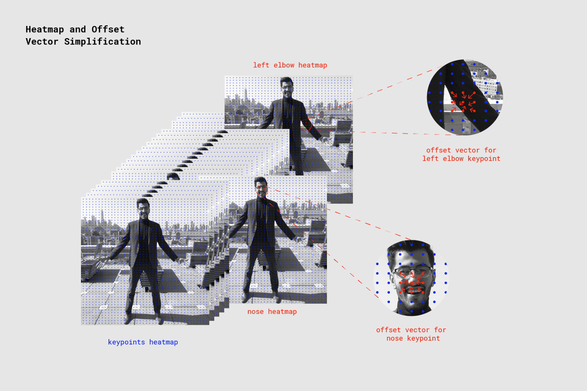

参考文献

1. https://arxiv.org/abs/1803.08225  
2. https://arxiv.org/pdf/1803.08225.pdf  
3. https://arxiv.org/abs/1701.01779

# (備忘録)PoseNetを使った姿勢推定 in Tensorflow

## 概要
Posenet : https://github.com/tensorflow/tfjs-models/tree/master/posenet  
を扱う  
このような姿勢推定(骨格推定)は、inputされた画像の どこ座標がどの点(肘とか手首とか)にあたるかを推定している。  
Posenetでは以下の17点を推定することが出来る。これらの点をKeypointと言う。  
```
0	nose
1	leftEye
2	rightEye
3	leftEar
4	rightEar
5	leftShoulder
6	rightShoulder
7	leftElbow
8	rightElbow
9	leftWrist
10	rightWrist
11	leftHip
12	rightHip
13	leftKnee
14	rightKnee
15	leftAnkle
16	rightAnkle
```
# Keypoint を見つけ出す仕組み
>参考(MobileNet版Posenetについて)  
>https://medium.com/tensorflow/real-time-human-pose-estimation-in-the-browser-with-tensorflow-js-7dd0bc881cd5

学習済みのMobileNetは、画像を入力すると以下の画像のような *keypoint heatmap* や**offset vectors** 等のテンソルを出力する。

画像中*keypoint heatmap* , **offset vectors** が格子状になっているのは、一連の処理を高速化させるための**outputStride** (メッシュ幅みたいなもの)が用意されているから。  
**outputStride**の数値を大きくするとメッシュが大きく切られ、処理速度は向上するが精度は落ちる。

そして*keypoint heatmap* をスコア化するためシグモイド活性化したもの→ **heatmapPositions** を用意する。


Keypointは以上の三要素 ( **heatmapPositions** , **offset vectors** , **outputStride** ) で計算されている。  
```keypointPositions = heatmapPositions * outputStride + offsetVectors```

## offset vectors について
これがPosenetの発明品のようだ  
Long-range offsets , Short-range offsets , Mid-range offsets  
の3種類あるが、この中でいちばん重要なものはShort-range offsetsである。  
offset vectorsは基本的にShort-range offsetsしたベクトルのデータの集まりのことを言っている。  
Long-range offsetsは姿勢推定では使わない。


### Long-range offsets
以下は例として鼻にかけてのLong-range offsets (vector)を表したものだ。  
  
  
>https://arxiv.org/pdf/1803.08225.pdf より  


ちなみにLong-range offsetsは姿勢推定では使っておらず(←セグメントモジュールで使われている)、姿勢推定モジュールでは以下の局所的な領域内でのベクトルを示したShort-range offsetsとMid-range offsetsを使っている。

### Short-range offsets について

Short-range offsetsはキーポイントの座標を一意的に決める各格子点を始点とするベクトル情報である。(outputStrideによって定められた格子点が10x20ある場合、1個のKeypointに対するShort-range offsetsのサイズは、各点ごとのx,y方向のベクトルそれぞれの情報を格納するので、20x10x2となる)  
**offset vectors**は全17個のKeypoint分のShort-range offsetsをひとまとめにしたものである。(つまり格子点が10x20ある場合、サイズは20x10x34となる)  

下の図では、鼻のヒートマップ付近のShort-range offsetsを参照し鼻のKeypointを検出する様子である(左肘も同様)    

  
### Mid-range offsets について

**Mid-range offsets**はKeypoint同士の位置, 接続関係を格納している。

### 


# モデル構造(MobileNet利用)
現在、精度が高く速度は遅いResNet版もあるが、MobileNet版に絞る  
↓はオリジナルのモデルについて  
>https://qiita.com/otmb/items/561a62d3413295cc744e
>
>本ページで触れていないが、outputStrideを16とし、入力画像サイズが513なので、```((513 - 1)// 16) + 1 = 33```より出力されるテンソルのサイズは1辺33となる。
>>計算式 https://medium.com/tensorflow/real-time-human-pose-estimation-in-the-browser-with-tensorflow-js-7dd0bc881cd5  
>>Resolution = ((InputImageSize - 1) / OutputStride) + 1  


通常の畳込みを1回、後  
```
depthwise_conv2d  
relu6  
conv2d 
relu6  
```
を13回繰り返し、4つのテンソルを出力し、  
更にそれぞれに畳み込みを1回行った、4つのテンソルを出力する。  
>カーネルサイズについて  
>https://github.com/tensorflow/tfjs/issues/1137
>https://github.com/tensorflow/tfjs/issues/1137#issuecomment-462450145
>```multi_person_mobilenet_v1_075_float.tflite```は後述で扱う

keypoint heatmapだけは前述の通り、シグモイド活性化させるが、他のテンソルはそのまま利用する。   

出力されるテンソルは keypoint, heatmap, offset vectors, horizontal, vertical directions と図では書いてあるが、  
プログラム中では heatmap, offset, displacementFwd, displacementBwd このような名前の扱いになっている。  
この(horizontal, vertical)もしくは(displacementFwd, displacementBwd)の正体はMid-range offsetsである。  

前述の通り、この出力された4テンソルを使い骨格の座標を計算する。   
しかし、最新のtfliteモデルは直接Keypointを出力するモデルを使っている...。


# モデルの解析
構造や計算方式がバージョン?によって大きく変わることが分かった。  
multiplierを0.75に固定し調査した。(tfliteのモデルが0.75のものしか見つからなかった) 
 
・オリジナル:tensorflow js版(checkpoint)  
>https://github.com/tensorflow/tfjs-models/tree/master/posenet  


・非公式python変換版(Protocol Buffer(.pb))   
入力サイズ自由  
出力4つ(heatmap, offset, mid-offsets(displacement_fwd, displacement_bwd)) 
>https://github.com/rwightman/posenet-python  
>model-mobilenet_v1_075.pb :  5.1MB 

・tensorflow lite公式ページのpose_estimation  
入力サイズ固定257x353    
出力4つ(heatmaps, short_offsets, mid_offsets, segments) 
>https://www.tensorflow.org/lite/models/pose_estimation/overview#get_started
multi_person_mobilenet_v1_075_float.tflite : 5.0 MB

・google-coral 用のtensorflow liteモデル  
これまでのものと異なり、直接Keypointsを出力するスタイル。  
入力サイズ固定(ファイル名に記載)  
出力4 poses(Keypoints), poses:1(keypoint_scores), poses:2(pose_scores), poses:3(空)  
>https://github.com/google-coral/project-posenet
>posenet_mobilenet_v1_075_353_481_quant_decoder_edgetpu.tflite : 1.5 MB
>posenet_mobilenet_v1_075_481_641_quant_decoder_edgetpu.tflite : 1.7 MB
>posenet_mobilenet_v1_075_721_1281_quant_decoder_edgetpu.tflite : 2.5 MB
___
## 非公式python変換版(Protocol Buffer(.pb)) 
### ファイルサイズ
model-mobilenet_v1_075.pb :  5.1MB  
(model-mobilenet_v1_101.pb : 13.3MB  )


### 出力
```
heatmap_2
offset_2
displacement_fwd_2
displacement_bwd_2
```
### 構造

  
tensorbordを使って解析を行い、上画像中 MobilenetV1の中を表示し画像化しようと試みたが、あまりにも長大な画像になってしまい添付しない。  
点検したところ、上記 モデル構造(MobileNet利用) と同じものになっていた。

___
### tensorflow lite公式ページのpose_estimation  
詳しいことがあまり載っていないが  https://www.tensorflow.org/lite/models/pose_estimation/overview#get_started  
ここからダウンロードしたもの。
Android, iOSに使う風だ。  

今まで2つに分かれていたmid_offsets が一つにまとまって出力され、新しくsegmentsが出力されるようになった。

#### K210用にkmodelへ変換  
```Fatal: Layer DepthwiseConv2d is not supported```  
とエラーを引き起こしてしまった。
>https://github.com/kendryte/nncase/issues/14#issuecomment-489506085  
>Check your DepthwiseConv2d with 3x3 kernel and 2x2 stride, there is a hardware limitation that you must use tf.pad([[0,0],[1,1],[1,1],[0,0]]) to pad your input and the use valid padding in your DepthwiseConv2d.

2x2ストライドのDepthwiseConv2d の前に tf.pad([[0,0],[1,1],[1,1],[0,0]])を置いて数合わせしてあげ、DepthwiseConv2dでのpaddingはvalidを使わなくてはいけないようだs


### ファイルサイズ
multi_person_mobilenet_v1_075_float.tflite : 5.0 MB

### 出力
```
float_heatmaps  
float_mid_offsets  
float_segments  
float_short_offsets  
```
### 構造
https://github.com/tensorflow/tensorflow/blob/master/tensorflow/lite/tools/visualize.py  を使用し中身を拝見した。visualize.py導入まとめは後述する。  
構造自体は今までのものと大きく変わらない  
 [multi_person_mobilenet_v1_075_float.tflite.html](/attachment/5d4abc0f72204300598a17e5)  
  
入力、conv2dの後  
```
depthwise_conv2d  
relu6  
conv2d 
relu6  
```
を13回繰り返し、
displacement_fwdとdisplacement_bwdをconv2dをした後くっつけてる。(ここだけ今までと異なる)
___
### google-coral 用のtensorflow liteモデル  
これまでのものと異なり、直接Keypointsを出力するスタイル。  
上のpose_estimationと比べ、とてもシンプルになっているが、何が起きているのか分からない。
Edge-tpu ライブラリを探る必要があるかもしれない。  
>https://github.com/google-coral/project-posenet/blob/master/pose_engine.py
#### 出力  
```
poses(Keypoints)
poses:1(keypoint_scores)
poses:2(pose_scores)
poses:3(空)  
```
#### ファイルサイズ
```
posenet_mobilenet_v1_075_353_481_quant_decoder_edgetpu.tflite : 1.5 MB
posenet_mobilenet_v1_075_481_641_quant_decoder_edgetpu.tflite : 1.7 MB
posenet_mobilenet_v1_075_721_1281_quant_decoder_edgetpu.tflite : 2.5 MB
```
#### 構造
入力サイズ353x481の  
posenet_mobilenet_v1_075_353_481_quant_decoder_edgetpu.tflite について  
[posenet_mobilenet_v1_075_353_481_quant_decoder_edgetpu.tflite.html](/attachment/5d4abe1172204300598a17e6)
```
nputs/Outputs
inputs
3 sub_2 UINT8 [1, 353, 481, 3]

outputs [4, 5, 6, 7] 
4 poses FLOAT32 [1, 10, 17, 2]
5 poses:1 FLOAT32 [1, 10, 17]
6 poses:2 FLOAT32 [1, 10]
7 poses:3 FLOAT32 []

Tensors
index	name	type	shape	buffer	quantization
0	MobilenetV1/heatmap_2/BiasAdd	UINT8	[1, 23, 31, 17]	0	{'scale': [0.047059], 'zero_point': [128], 'details_type': 'NONE', 'quantized_dimension': 0}
1	MobilenetV1/offset_2/BiasAdd	UINT8	[1, 23, 31, 34]	0	{'scale': [0.392157], 'zero_point': [128], 'details_type': 'NONE', 'quantized_dimension': 0}
2	concat	UINT8	[1, 23, 31, 64]	0	{'scale': [1.387576], 'zero_point': [117], 'details_type': 'NONE', 'quantized_dimension': 0}
3	sub_2	UINT8	[1, 353, 481, 3]	0	{'scale': [0.007812], 'zero_point': [128], 'details_type': 'NONE', 'quantized_dimension': 0}
4	poses	FLOAT32	[1, 10, 17, 2]	7	{'min': [-10.0], 'max': [10.0], 'details_type': 'NONE', 'quantized_dimension': 0}
5	poses:1	FLOAT32	[1, 10, 17]	2	{'min': [-10.0], 'max': [10.0], 'details_type': 'NONE', 'quantized_dimension': 0}
6	poses:2	FLOAT32	[1, 10]	6	{'min': [-10.0], 'max': [10.0], 'details_type': 'NONE', 'quantized_dimension': 0}
7	poses:3	FLOAT32	[]	8	{'min': [-10.0], 'max': [10.0], 'details_type': 'NONE', 'quantized_dimension': 0}


Ops
index	inputs	outputs	builtin_options	opcode_index
0	[3]	 [0, 1, 2]	None	CUSTOM (0)
1	[0, 1, 2]	[4, 5, 6, 7]	None	CUSTOM (1)
```
```CUSTOM```の正体が謎  