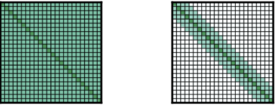

# Video Vision Transformer

自然言語処理においてSOTAを掻っ攫っていったトランスフォーマーですがCVにおいても非常に強力なアーキテクチャであることが発覚しました。
画像認識ができるってことは動画認識も出来ちゃうんじゃ？ってことで調べてみました
。

## TL;DR

現状の動画認識（主に動作認識）は３DCNNや2DLSTM等が主流。
しかし，３DCNNは短い距離の依存関係しかモデリングできないため、長いクリップの動画に対して，短いクリップで推論を行っていた．
これは直感に反するため、Transformerを使って，長い系列データを処理できる仕組みを提案。

一方で、通常のTransformerで長い系列データを処理しようとすると計算リソースが非常に大きくなってしまうというデメリットがある。

そこで，長文章を高速に処理可能である既存手法であるLongformerを利用することで計算量と長時間のクリップの学習を可能にした。

SOTA手法と比較すると同程度の精度を維持したまま、学習速度を16.1倍、推論速度を5.1倍に高速化することに成功。

([元論文](https://arxiv.org/pdf/2102.00719.pdf))

## Longformer（長文章処理モデル）

自然言語処理のモデルで，Transformerの問題点である計算リソースをO(n^2)からO(n\*w)に減少させたことで，長い文章に対しても利用できるようにした(w：ウィンドウサイズ)。

計算リソースを減少させるために2つのAttention機構を搭載している。

左からFull n2 attention(普通のattention)，Sliding Window Attention，Global+Sliding Attention。

1. Sliding window attention
   自分自身のすぐ近くだけにattentionを向ける構造をとり，ウィンドウサイズをwとし，自分自身から左右それぞれ1/2w個の単語にattentionを向ける。

   これによって計算リソースがO(n^2)からO(n\*w)に減少させることができる。

   ウィンドウサイズはレイヤーごとに変えることで，精度が向上することが実験で示されている。
   具体的には低位のレイヤーはウィンドウサイズを小さくし，上位のレイヤーになるにつれて大きくする．これによって低位のレイヤーはより局所的な情報を集約し，上位のレイヤーは全体的な情報を集約することで精度が向上する。
2. Global attention
   Sliding Window Attentionと一緒に使われる。  
   特定の単語位置の単語については，全ての単語に対してattentionを向け，全ての単語はその特定の単語位置にattentionを向けるようにする。  
   BERTでは一番初めの単語に[CLS]というトークンを付加して，最終的な分類に使用しているため[CLS]トークンは非常に重要である.そのため，[CLS]に対してglobal attentionを適用する。  
   Video Transformer Networkでも同様の理由で，[CLS]に対してglobal attentionを適用する。

## アーキテクチャ

アーキテクチャの全体像を以下に示す．

![vt_imgs/3.png]](vt_imgs/3.png)

各コンポーネント

1. Spatial Backbone
   >>> アーキテクチャの`f(x)`に当たる部分で，各フレームから空間特徴量を抽出する．モジュールは2DCNNでもTransformerでも良い．
   >>> Ablation Studyでは，バックボーンの性能が高いほど行動認識の精度も高くなった．また，重み固定よりファインチューニングした方が精度が高くなった．

2. Temporal attention-based encoder

   上述のようにLongformerを利用する．具体的にはSpatial Backboneで抽出された空間特徴量をPositional Encodingに通して入力する。  
   BERTと同様に[CLS]トークンをHeadにつけて，分類タスクに使う。

   Ablation Studyでは，層の深さを変化させたが，深ければ深いほど良いというわけではなかった．これは使用したデータセットのビデオが１０秒前後と短かったかららしい。  
3. Classification MLP head
   2層のMLPで，Temporal attention-based encoderの[CLS]トークンを入力する．
   分類の結果が出力される。  

## Ablation Experiments

Kinetics-400データセットで検証を行なった。

* フレーム数やフレームレートを変えて実験したが，精度は変わらなかった．
* 学習と検証にかかる時間について，SlowFast(SOTA手法)と比べてパラメータ数は大きいが，収束が早いため学習時が16.1倍，推論時が5.1倍高速化した。
* Attentionを以下のように定性評価した．関連領域の重みが高くなっていることからAttentionは役割を果たしていると評価できた。

(懸垂下降の動画で，内容的に近いフレームで重みが高くなっている．)
